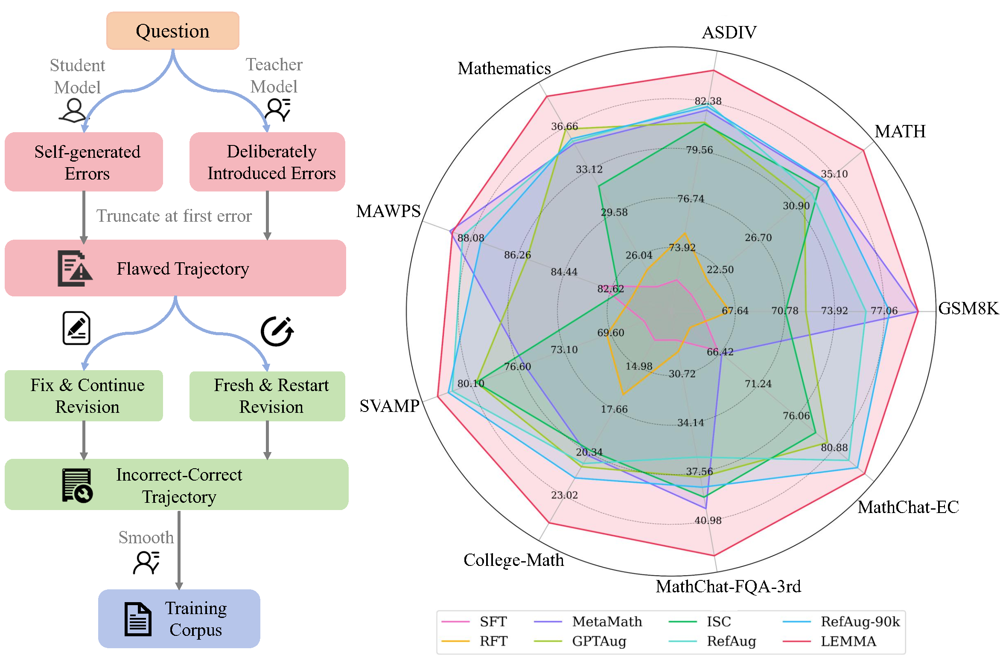
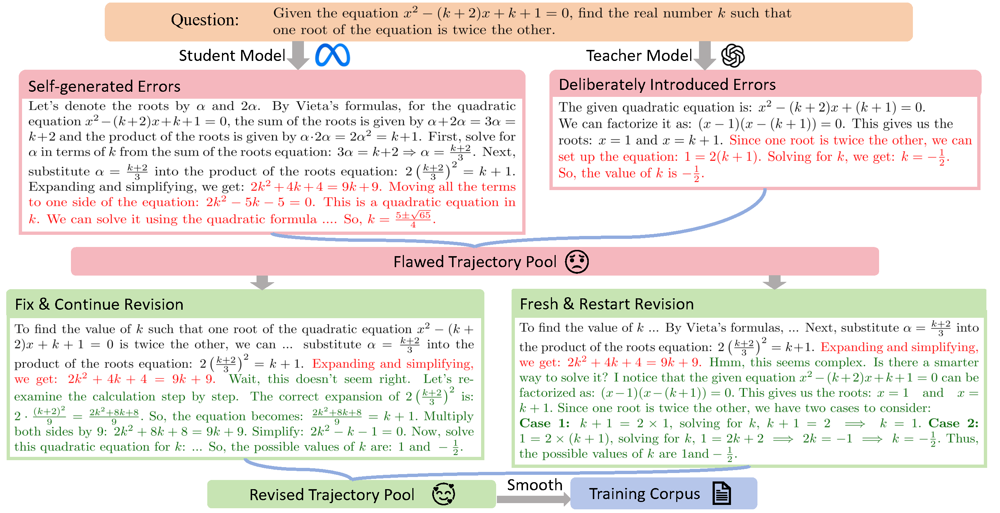
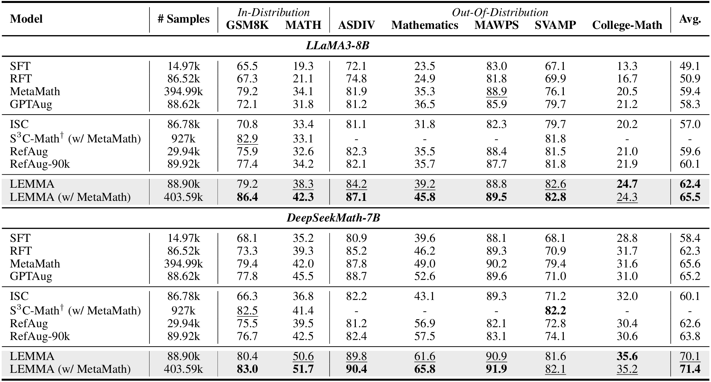

<div align="center">
<h1>✍️ LEMMA: Learning from Errors for MatheMatical Advancement in LLMs</h1>
</div>

[](CODE_LICENSE)
[](Model/LICENSE)
[](https://www.python.org/downloads/release/python-390/)

<p align="center">
🤗 <a href="https://huggingface.co/panzs19/LEMMA-LLAMA-3-8B" target="_blank">HF Model</a> • 💾 <a href="https://huggingface.co/panzs19/LEMMA" target="_blank">HF Dataset</a> • 📃 <a href="" target="_blank">Paper</a><br>
</p>

<p align="center" width="100%">
<a ></a>
</p>

| Model | Checkpoint | Paper  | GSM8k | MATH  | License|
| ----- |------| ---- |------|-------| ----- |
| LEMMA-LLAMA-3-8B | 🤗 <a href="https://huggingface.co/panzs19/LEMMA-LLAMA-3-8B" target="_blank">HF Link</a> |  📃 <a href="" target="_blank">[LEMMA]</a>| **79.2**  |  **38.3**	| <a href="https://www.llama.com/llama3/license/" target="_blank">Llama 3  </a> |
| LEMMA-LLAMA-3-70B | 🤗 <a href="https://huggingface.co/panzs19/LEMMA-LLAMA-3-70B" target="_blank">HF Link</a> |  📃 <a href="" target="_blank">[LEMMA]</a>| **91.5**  |  **51.8** | <a href="https://www.llama.com/llama3/license/" target="_blank">Llama 3 </a> |

## 📝 Key Takeaways
💡 **Systematic analysis on error types**: Categorizes common model-generated mathematical reasoning errors, revealing consistent error patterns across models and guiding targeted improvements.

💡 **Error-type grounded error augmentation**: Introduces diverse and meaningful errors by leveraging a teacher model to _intentionally inject representative mistakes_ with type sampled from the analyzed distribution, enhancing the model’s ability to learn from failures.

💡 **Two complementary self-correction mechanisms**: Combines _Fix & Continue_ (correcting mistakes within the original reasoning) and _Fresh & Restart_ (restarting the reasoning process from scratch) to generate effective revision trajectories.

✅ **LEMMA** – A novel framework that fine-tunes LLMs on error-corrective trajectories, enabling autonomous error detection and correction during mathematical reasoning.

📊 **Result** – Up to 13.3% accuracy improvement for LLaMA3-8B with only 90k synthesized data.

The framework of LEMMA. LEMMA uses an _error-type grounded mistake augmentation_ module, and explores _two error correction strategies_ to construct the error-corrective trajectory as training corpus.

<p align="center" width="100%">
<a ></a>
</p>

Experiments demonstrate that LEMMA significantly outperforms SOTA baselines. LEMMA-trained models also achieve strong generalization ability through evaluation on out-of-distribution (OOD) benchmarks. 

<p align="center" width="100%">
<a ></a>
</p>

<h3 id="env">🎯 Quick Start</h3>
LEMMA mainly requires the following two packages:

- [LLaMA-Factory](https://github.com/hiyouga/LLaMA-Factory) for model training.

- [math-evaluation-harness](https://github.com/ZubinGou/math-evaluation-harness) for evaluation. We use the version adapted from [Qwen2.5-Math](https://github.com/QwenLM/Qwen2.5-Math).

```bash
# Install LLaMA-Factory
git clone --depth 1 https://github.com/hiyouga/LLaMA-Factory.git
cd LLaMA-Factory
pip install -e ".[torch,metrics]"

# Install Qwen Evaluation Tool Case, which is is adapted from math-evaluation-harness.
git clone https://github.com/QwenLM/Qwen2.5-Math
cd Qwen2.5-Math
cd latex2sympy
pip install -e .
cd ..
pip install -r requirements.txt 
pip install vllm==0.5.1 --no-build-isolation
pip install transformers==4.42.3
```

<h3 id="Inference">💾 Dataset Usage</h3>

Run the following command to load the data:

```python
from datasets import load_dataset
dataset = load_dataset("panzs19/LEMMA", split="train")
```

<h3 id="train">📈 Training</h3>

Download the [LEMMA](https://huggingface.co/panzs19/LEMMA) dataset from huggingface and convert it to the json format. 

```python
dataset = load_dataset("panzs19/LEMMA", split="train")

dataset_list = dataset.to_list()

with open('your_data_dir/dataset.json', 'w', encoding='utf-8') as f:
    json.dump(dataset_list, f, indent=4, ensure_ascii=False)
```

Specify the data path in [scripts/train.sh](scripts/train.sh) and [LLaMA-Factory/data/dataset_info.json](LLaMA-Factory/data/dataset_info.json).

```
bash scripts/train.sh
```

<h3 id="evaluation">📏 Evaluation</h3>

We use the evaluation tool case in [Qwen2.5-Math](https://github.com/QwenLM/Qwen2.5-Math) repository. We provide a shell script to launch all evaluations after training the model.

```
# Specify the model path in scripts/eval.sh
bash scripts/eval.sh
```

The inference prompt is:
```
"### Instruction:\n{instruction}\n\n### Response: Let's think step by step."
```

For evaluation on mawps and deepmind_math, we use the data provided in [RefAug](https://github.com/ytyz1307zzh/RefAug) repository to ensure a fair comparison.

<h3 id="Inference">⚙️ Dataset Collection</h3>

To collect your own LEMMA data, please refer to the following scripts: 

```bash 
# Error type and step analysis
bash scripts/error_type.sh
bash scripts/error_step.sh
# Error Augmentation
bash scripts/error_inject.sh
# Fresh & Restart Correction
bash scripts/error_connect.sh
# Fix & Continue Correction
bash scripts/error_correct.sh
# Smooth
bash scripts/smooth.sh
```

Thanks for the open source code of [LLaMA-Factory](https://github.com/hiyouga/LLaMA-Factory), [math-evaluation-harness](https://github.com/ZubinGou/math-evaluation-harness) and [Qwen2.5-Math](https://github.com/QwenLM/Qwen2.5-Math). Some of our codes are based on them.

## Citation

Please cite the paper if you refer to our model, code, data or paper from MetaMath.

```
@article{lemma,
  title={LEMMA: Learning from Errors for MatheMatical Advancement in LLMs},
  author={Zhuoshi Pan, Yu Li, Honglin Lin, Qizhi Pei, Zinan Tang, Wei Wu, Chenlin Ming, H. Vicky Zhao, Conghui He, Lijun Wu},
  journal={Arxiv},
  year={2025}
}
```
